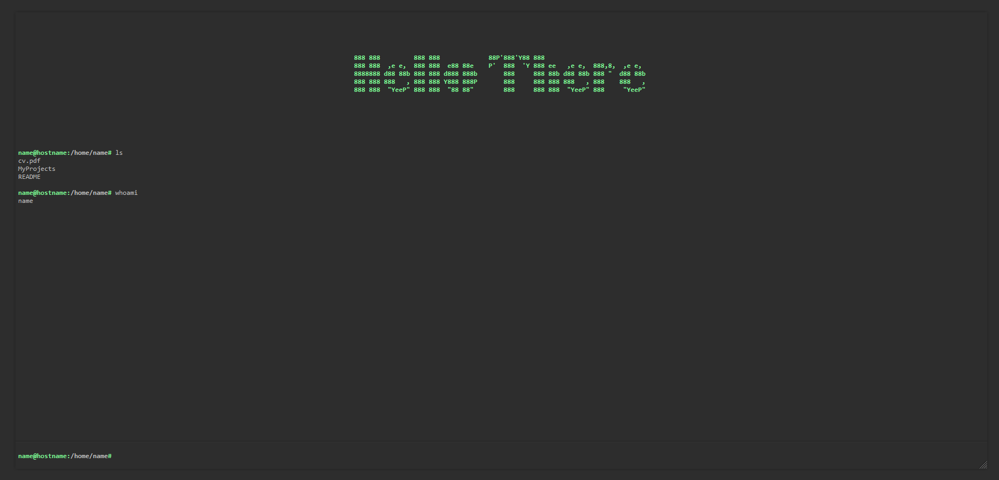

# cv-shell

A toothless webshell, deployed in docker. Forked from a p0wny and slightly reconfigured not to serve offensively 

## Requirenments: 

* Modern version of Linux
* Docker Engine no older than 3.7
* User in the docker group without sudo privs

## Installation: 

1. Setup your .env 
2. Add your files to /upload folder
3. run `docker compose up`